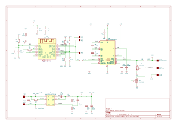
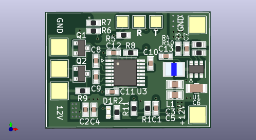
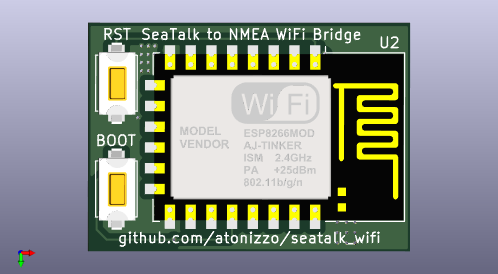

# SEATALK_WIFI
The hardware and the included software of this project create a
bridge between a Raymarine SeaTalk1 instrument and NMEA. The NMEA
sentences generated are sent via a WiFi connection to a remote
client. This connection can be directly used with chart plotters such as
[OpenCPN](https://opencpn.org/).

## Hardware
The hardware is made up of a simple board that will connect to to a 12V source
on the right side and to a Seatalk connector on the other (see PCB layout
pictures below). The board provides 12V to power the target instrument so that
the only connection needed for the system to work is a 12V from the boat
electrical panel.

The circuit is not fused and it is expected that a 1A fused be provided by
the installer.

###Schematic

### PCB Layout

The board has been designed with KiCad and the fabrication files are provided
in the fab/ directory.

Board dimensions are 31 mm x 22 mm.

#### Front Side

On the right side of the board the pads, from top to bottom, are:

- GND
- 12V (unfused, use a 1A fuse)

These pads are conneced to a fused 12V line from the battery.

On the left side of the board the pads are meant to be connected to a Raymarine
SeaTalk instrument and are, from top to bottom:

- GND (typically a wire with a black insulator or no insulator)
- SeaTalk (typically a wire with a yellow insulator)
- 12V (typically a wire with a red insulator)

On the top side of the board the pads, from left to right, are:

- Serial Logger (unmarked on the PCB) This pin is connected to the TX pin
of serial port 2 of the ESP 12 and emits serial data that is mainly
used for debugging of software. If enabled by the user it can also output a
pretty print of each SeaTalk handled.

- Programming cable RX line (marked with R in the layout). This is connected
to the RX pin of serial port 1 of the ESP12 and is primarily used to program
the device. Serial port 1 is used for both programming the board as
well as to receive the SeaTalk sentences from the instrument. This means that
this pin must be disconnected from the programmer before resetting the board
to to prevent interference between the programmer hardware and the SeaTalk
instrument. Failure to disconnect this cable during regular use will prevent
the SeaTalk sentences from being received by the MCU.

- Programming cable TX line (marked with T in the layout) is connected to the
TX pin of the ESP12.

Since the board is run at 3.3V the typical programming is performed with a
USB to serial converter connected to pads R, T and GND. If no further software
development is expected the programming cable should be disconnected from the
board and the pads left unconnected.

#### Back Side

The two switches on the left side are only used to program the board and are
typically removed before they board is installed on the boat.

In order to program the board the RTS switch (the top one in the picture)
should be pulsed **while the BOOT switch is kept pressed**. At this point
the board is ready for the programmer to write the new software.

## Software
The software must be compiled with the Arduino GUI. The only library that must
be installed is Lennart Henning's ESPTelnet library which is used for the
both the Telnet server and the NMEA server.

### Configuration via Web Page
The software runs a very simple web server that serves a single web page used
to configure a few parameters of the bridge. Among other things the page allows
enabling or disabling of the serial and telnet logging windows and the port
at which the NMEA server is listening. During the first start the software
creates a configuration space in EEPROM and stores a few default parameters.
The defaults are:

- Serial logger disabled
- Telnet logger disabled
- The default NMEA port is 3030

The hostname for the instrument is "wind" and can be changed in the software
before programming (see seatalk_wifi.h file).

The web page also lists the SeaTalk sentences that are supported by the bridge.

### Telnet Logger
The software runs a Telnet server that outputs a pretty print of all the
commands received, exactly the same information that can be output on the
serial port. This is not the actual NMEA data but rather descriptive
information of each Seatalk command in the order that it was processed.

## Further Developmnent
The board can be improved in a number of ways.

### Handling Additional SeaTalk Sentences
The only instrument the author has is an ST40 wind instrument and the messages
that are emitted by it are those bridged in the current release. The software
processes the Seatalk sentences using a state machine and it makes rather
trivial job to add new commands.

### Adding the Ability to Send SeaTalk Sentences
The current release does not allow transmitting of Seatalk sentences simply
because there was no need for it in the only ST40 instrument owned by the
author. 

In receive mode, the parity bit is extracted using a gimmick that involves
checking for RX errors and then assuming that any such error is due to parity
violation, but when sending data the parity bit has to be handled
as a 9th bit independent of the others which makes it impossible to use the
hardware serial port TX pin to do this. When configured to use serial parity
the ESP12 core sets parity based on the bt pattern to send and does not allow
independently setting the value of the parity bit. For this reason
the SeaTalk TX line is connected to a GPIO in the expectation that a the TX
signal can be bit-banged out of it.

Since SeaTalk is a multiple access protocol the ability to transmit sentences is
made more challenging by the need to detect possible interfence from other
instruments trying to talk over each other.

# Contact
<atonizzo@gmail.com>

