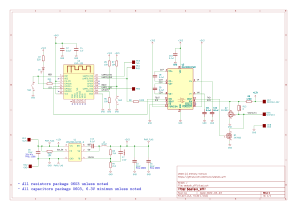
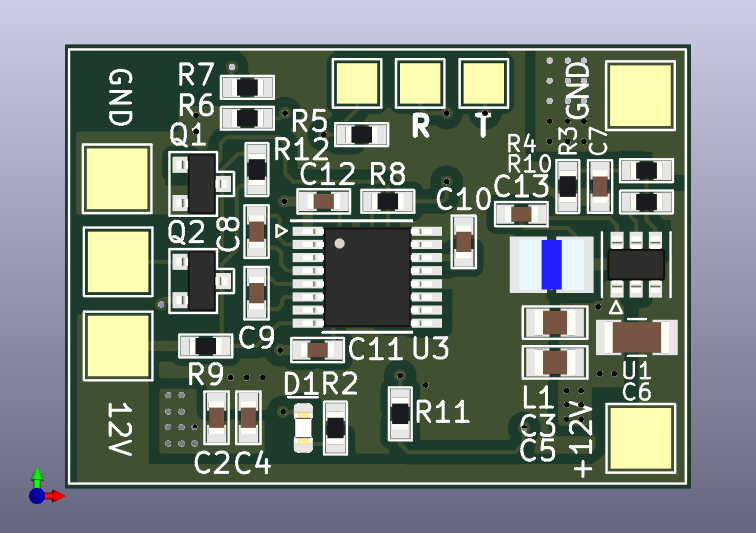
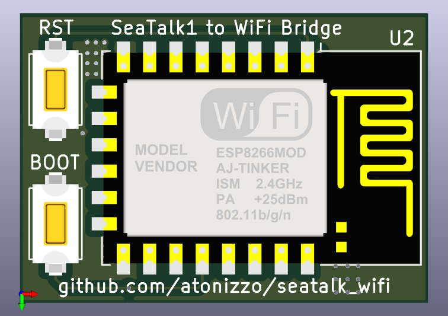

# <p align=center>SEATALK_WIFI</p>

---
### Table of contents
1. [Introduction](#introduction)
2. [Hardware](#hardware)
    1. [Schematic](#schematic)
        1. [Serial Bridge](#serial_bridge)
    2. [PCB Layout](#pcb_layout)
        1. [Front Side](#front_side)
        2. [Back Side](#back_side)
3. [Software](#software)
    1. [Configuration via Web Page](#web_page)
        1. [Configuration for Wind Instrument](#wind_instrument)
    2. [Serial Logger](#serial_logger)
    3. [Telnet Logger](#telnet_logger)
    4. [NMEA Server](#nmea_server)
        1. [NMEA Talker](#nmea_talker)
    5. [Software Debug Port](#debug_port)
4. [Further Development](#further_development)
5. [Holder for ST40 devices](#st40_holder)
5. [Contact](#contact)
---

# <a name="introduction"></a> Introduction 
The hardware and the included software of this project create a
bridge between a Raymarine SeaTalk1 instrument and NMEA. The NMEA
sentences generated are sent via a WiFi connection to a remote
client. This connection can be directly used with chart plotters such as
[OpenCPN](https://opencpn.org/).

The advantages of this solution are:

- Allows older instrumentation using SeaTalk1 to be connected to newer
chartplotters receiving NMEA sentences via WiFI
- The WiFi link allows the instrumentation to be installed in
out-of-the-way location thus freeing space in the navigation area
- The board can be installed very close to the data source and does not
require laying out data cables to a chart plotter. All that is needed
is a 12 Volt connection to the battery

# <a name="hardware"></a> Hardware 
The hardware is a simple board with pads designed to connect to to a 12V
source on one side (typically a switched and fused boat battery) and to
a Seatalk connector on the other 
(see <a href="### PCB Layout">PCB layout pictures</a>). The
board supplies 12V to power the target instrument so that the only
connection needed for the system to work is a 12V from the boat
electrical panel.

The hardware board is not fused. It is expected that a 0.5A fast acting fuse
be provided on the 12V supply line going to the circuit. The 12V wire
that powers the circuit should also be fused at the distribution panel
or go through an appropriately sized resettable circuit breaker.

## <a name="schematic"></a> Schematic 


During the development of the circuit it was noticed that the Raymarine
instrument being used (an ST40 wind instrument) was very sensitive about
loading of the SeaTalk serial line. To isolate the SeaTalk data line from
the rest of the circuitry Q2 acts as a buffer.

U1 implements a regulator rated to least 2A. An earlier version of this board
designed with a linear regulator showed that the regulator tended to overheat,
which prompted a redesign using a switching topology.

###  <a name="serial_bridge"></a> Serial Bridge   
R12 allows the board to be used as a receive-only serial to WIFI bridge. In 
order to use this feature, the changes to the schematic are:

| Remove | Install |
| :---:  | :---:   |
| Q1     | R12     |
| Q2     |         |
| R9     |         | 

Now the center pad can be connected to a TX pin of the RS232 port of a
NMEA device and the serial stream of NMEA sentences can be sent out to
WIFI.

## <a name="pcb_layout"></a> PCB Layout 

The board has been designed using KiCad and the fabrication files are provided
in the fab/ directory.

Board dimensions are 31 mm x 22 mm.

### <a name="front_side"></a> Front Side


On the right side of the board the pads, from top to bottom, are:

- GND
- 12V (unfused, use a 1A fuse)

These pads are connected to the boat battery. A better installation
would require powering this board from the same switched connection
that powers the navigation station.

On the left side of the board the pads are meant to be connected to a
Raymarine SeaTalk instrument. A SeaTalk1 cable has 3 wires that are
color coded and the typical color of the insulating jacket is shown
in the list. From top to bottom:

| Function    | Jacket Color       |
| :---:       | :---:              |
| GND         | black or bare wire |
| SeaTalk     | yellow             |
| +12V        |  red               | 

On the top side of the board the pads, from left to right, are:

- Serial Logger (unmarked on the PCB) This pin is connected to the TX pin
of serial port 2 of the ESP12 and -if enabled by the user- emits a
pretty print of all the commands handled by the hardware 
(see <a href="### Serial Logger">Serial Logger</a>).

- Programming cable RX line (marked with R in the layout). This is connected
to the RX pin of serial port 1 of the ESP12 and is primarily used to program
the device. Serial port 1 is used for both programming the board as
well as to receive the SeaTalk sentences from the instrument. During
development this means that this pin must be disconnected from the
programming cable before resetting the board to to prevent interference between
the programmer hardware and the SeaTalk instrument. Failure to disconnect
this cable during regular use will prevent the SeaTalk sentences from
being received by the MCU

- Programming cable TX line (marked with T in the layout) is connected to the
TX pin of the ESP12 and is only used during programming. It can also be
used to output debug information during debug but the terminal must be
programmed with the same serial parameters used by SeaTalk, which are
usually 4800 bauds, 8 bits, Even parity, 1 Stop bit.

Since the board power supply is 3.3V the typical programming is performed with a
USB to serial converter connected to pads R, T and GND. If no further software
development is expected the programming cable should be disconnected from the
board and the pads left unconnected.

### <a name="back_side"></a> Back Side


The two switches on the left side are only used to program the board and are
typically removed before the board is installed on the boat.

In order to program the board the RST switch (the top one in the picture)
should be pulsed **while the BOOT switch is kept pressed**. At this point
the board is ready for the programmer to write the new software.

# <a name="software"></a> Software
The software can be compiled using the Arduino GUI. The only library required
is Lennart Henning's ESPTelnet library which is used for the
both the Telnet server and the NMEA server.

## <a name="web_page"></a> Configuration via Web Page
The software runs a web server that serves a single web page used
to configure a few parameters of the bridge. Among other things the page allows
setting the output power for the WiFi transmitter, enabling or disabling
of the serial and telnet logging windows and the port
at which the NMEA server is listening. During the first start the software
creates a configuration space in EEPROM and stores a few default parameters.
The defaults have been chosen to aid in the debgging of the board during firts
installation and can be changed accordingly after full operation has been
achieved. The built in defaults are:

- Serial logger enabled
- Telnet logger enabled
- The default primary NMEA port is 3030
- The default NMEA talker is "LR"
- Activity LED enabled

An example of the web page is shown in the following picture.


The default hostname for the instrument is "wind" and can be changed in the
software before programming (see [sw/seatalk_wifi.h](sw/seatalk_wifi.h))
or at a later point via the configuration web page.

The web page also lists the SeaTalk sentences that are supported by the bridge.

### <a name="wind_instrument"></a> Configuration for Wind Instrument
In gusty wind conditions the wind angle -and to a lesser extent the speed- returned
by the wind instrument are subject to very quick jumps only to then return to
prevailing conditions. To filter out some of the noise introduced by these
jumps the angle and speed data can be independently processed by a simple
moving average filter. Whether these filters are enabled and their lenght
can be configured from the web page in the fieldset specific to the wind
instrument.

## <a name="serial_logger"></a> Serial Logger
A timestamped pretty print of all the commands handled by the bridge is
printed out to the serial logger, connected to Serial1 (for wiring information
see <a href="#### Front Side">Front Side</a>). This is not the actual NMEA
data but rather descriptive information of each Seatalk command in the
order that it was processed.

In the log -and assuming the coloring is enabled- the command byte is typically
printed in blue, the payload in the regular terminal color, the name of the
command in green and the arguments in terminal color.

Errors are also logged. In this case the byte that caused the error is shown
in red. If any error occurs the entire packet received up until that moment
is tossed and the software will start seeking another command to interpret.
There are 3 types of errors:

- Unrecognized commands, which are commands with the parity bit set but
that are not among those recognized by the software
- Parity violations, where a payload byte was received with the parity
bit set
- Framing violations, where one of the payload bytes was received that
was not consistent with the command being handled.

In the latter 2 cases the argument column provides information about
the offending byte.

## <a name="telnet_logger"></a> Telnet Logger
The software runs a Telnet server that outputs a pretty print of all the
commands received, exactly the same information that can be output on the
serial port.

## <a name="nmea_server"></a> NMEA Server
The NMEA sentences are available at the port selected in the settings and
can be accessed directly via the communication configuration of
chartplotters such as [OpenCPN](https://opencpn.org/). The software
will send NMEA data to either NMEA ports as long as there is a connection.

There is a secondary NMEA server that serves the exact same content as
the primary and it can be connected at the primary port number plus one.

### <a name="nmea_talker"></a> NMEA Talker
The NMEA talker can be selected through the web page configuration.
The default talker, written in EEPROM upon first boot, is "LR".

## <a name="debug_port"></a> Software Debug Port
Since the Serial TX line of the programming cable (UART0_TXD in the schematic)
is not shared with SeaTalk it is used to send out debug information that is
useful during installation. To see the output of this port the terminal should
be configured with the same setting as SeaTalk (8 bit, Even parity, 1 Stop bit).
The information output shows the content of the configuration EEPROM as well
as the output from the connection to a WiFi network.

# <a name="further_development"></a> Further Developmnent
The board can be improved in a number of ways.

## Handling Additional SeaTalk Sentences
The only instrument available for development was an ST40 wind instrument and
the messages that are emitted by that instrument are the only one currently
recognized by the software. The software processes the Seatalk sentences using
a state machine and it makes rather trivial job to add code that handles new
sentences.

## Adding the Ability to Transmit SeaTalk Sentences
The current release does not allow transmitting of Seatalk sentences because
there was no need for it in the only ST40 instrument used for development. 

In receive mode, the parity bit is extracted using a technique that involves
checking for RX errors and then assuming that any such error is due to parity
violation (this is required by the way errors are handled in the serial library
of the ESP8266 device), but when sending data the parity bit has to be handled
as a 9th bit independent of the others which makes it impossible to use the
hardware serial port TX pin to do this. When configured to use serial parity
the ESP8266 core sets parity based on the bit pattern to send and does not allow
independently setting the value of the parity bit. For this reason the SeaTalk
TX line is connected to a GPIO in the expectation that a the TX signal can be
bit-banged out of it.

Since SeaTalk is a multiple access protocol the ability to transmit sentences
requires the need to detect possible interfence from other instruments trying
to talk over each other. Since the SeaTalk line is a single one, the
transmitted data is also received back by the bridge, which can compare it
with the data transmitted to detect collisions.

# <a name="st40_holder"></a> Holder for ST40 devices
With the NMEA data now sent via WiFI the ST40 device can optionally be
installed in a more secluded place, clearing up some space in the navigation
station. A 3D printed mount allows installing the bridge PCB behind the
instrument itself and holding the instrument in place with an M3x8
pinch cap screw.

Original FreeCAD file and STEP files are provided in the ```holder```
directory.


# <a name="contact"></a> Contact
<atonizzo@gmail.com>

